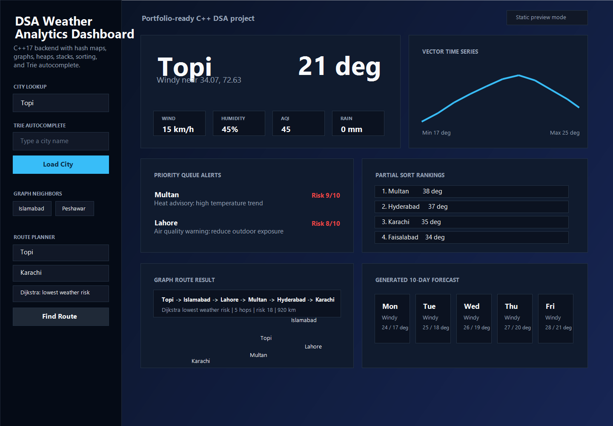

# Pakistan Weather Dashboard

> A C++17 weather analytics server + interactive browser UI, built to show that the data structures you study in class can actually power something real.



---

## The Story

This started as a DSA course project. The brief was *"implement a hash map and a graph"* — the kind of assignment where most people write a console app, print some output, and call it done.

I wanted to see what those structures look like when they're doing actual work. So instead of a console app, there's a C++ HTTP server. Instead of hard-coded nodes, there's a map of Pakistani cities with real coordinates. And instead of printing a path, there's a route planner that compares BFS against Dijkstra and tells you which road between Topi and Karachi has the lowest weather risk.

It's not a production weather app. But every feature traces directly back to a data structure — and you can inspect all of it.

---

## What It Does

Search any of the 10 cities and you get live weather cards, hourly/weekly/monthly temperature charts, a 10-day forecast, and a wind compass. The more interesting parts are under the hood:

- **Route Planner** — ask for the path from any city to any other. Pick *fewest hops* (BFS) or *lowest weather risk* (Dijkstra with composite edge weights from AQI, wind, rain delta, and temperature).
- **Autocomplete** — the search box uses a Trie. Start typing "Is" and it suggests Islamabad in O(k) time, not O(n).
- **Alert Feed** — a max-heap surfaces the most severe weather alerts first. No sorting on every read.
- **Hot/Cold Rankings** — `std::partial_sort` to find the top-k cities without sorting the whole dataset.

---

## The DSA Layer

Every structure here is doing a specific job, not just checking a box:

| Structure | Lives In | Why It's Here |
|---|---|---|
| `unordered_map` | `cityDatabase` | O(1) average city lookup by name |
| Adjacency list | `cityGraph` | Sparse graph — most cities connect to 2–4 others |
| BFS | `shortestRouteBfs` | Unweighted shortest path (fewest hops) |
| Dijkstra | `safestRouteDijkstra` | Weighted shortest path (lowest weather risk) |
| Max-heap | `alertSystem` | Highest severity alert always at top, O(log n) insert |
| Trie | `autocomplete` | Prefix search in O(prefix length), not O(cities) |
| `std::vector` | Time-series data | Contiguous hourly/weekly/monthly/yearly arrays |
| `std::partial_sort` | `getHottestCities` | Top-k in O(n log k), not O(n log n) |
| `std::deque` | `requestLog` | O(1) push and pop on both ends for the request log |

Edge weights in Dijkstra aren't arbitrary — `riskScore()` builds them from the average AQI, wind speed, temperature delta, and rainfall between two cities. Distances use the Haversine formula on real lat/lon coordinates.

---

## Project Structure

```
.
├── CMakeLists.txt
├── data/
│   └── weather_data.csv        # City data — edit this to add cities
├── docs/screenshots/
│   └── dashboard.png
├── include/
│   ├── WeatherEngine.hpp       # All DSA lives here
│   └── NetworkUtils.hpp        # Thin WinSock2 HTTP wrapper
├── public/
│   └── index.html              # Frontend — works standalone too
├── src/
│   └── main.cpp                # Server, routing, JSON serialization
└── tests/
    └── weather_engine_tests.cpp
```

---

## Build & Run

**Requirements:** C++17 compiler, CMake 3.16+. On Windows use Visual Studio Build Tools or MinGW-w64.

```bash
cmake -S . -B build
cmake --build build
```

```bash
# Linux / macOS
./build/weather_dashboard

# Windows
.\build\Debug\weather_dashboard.exe
```

Then open **http://localhost:8080** 


---

## Run Tests

```bash
cmake -S . -B build && cmake --build build
ctest --test-dir build --output-on-failure
```

Tests cover: CSV loading, city lookup, Trie autocomplete, graph neighbors, BFS path endpoints, Dijkstra found+risk, alert ordering, hottest/coldest sort, and request logging.

---

## API

```
GET /api/cities                              — all cities
GET /api/weather?city=Lahore                 — full weather + forecast
GET /api/suggest?q=is                        — Trie autocomplete
GET /api/hottest?k=5                         — top-k hottest
GET /api/coldest?k=3                         — top-k coldest
GET /api/alerts?k=5                          — top-k alerts by severity
GET /api/route?from=Topi&to=Karachi&mode=bfs
GET /api/route?from=Topi&to=Karachi&mode=safe
GET /api/requests                            — recent request log
```

Example Dijkstra response:

```json
{
  "found": true,
  "algorithm": "Dijkstra lowest weather risk",
  "path": ["Topi", "Islamabad", "Lahore", "Multan", "Quetta", "Karachi"],
  "hops": 5,
  "total_risk": 21,
  "total_distance_km": 1120
}
```

---

## Adding a City

Open `data/weather_data.csv` and add a row:

```
Name,Lat,Lon,Temp,Condition,Wind,Humidity,AQI,Rain,WindDir
Abbottabad,34.15,73.21,18,Cloudy,10,60,80,3.0,20
```

Then add its graph connections in `src/main.cpp` inside `seedRoutesAndAlerts()`:

```cpp
engine.addRoute("Islamabad", "Abbottabad");
```

Restart the server.

---

## What's Next

- GitHub Actions CI (CMake build + ctest on push)
- Live route path drawn on the Leaflet map
- Real weather API ingestion behind the CSV loader
